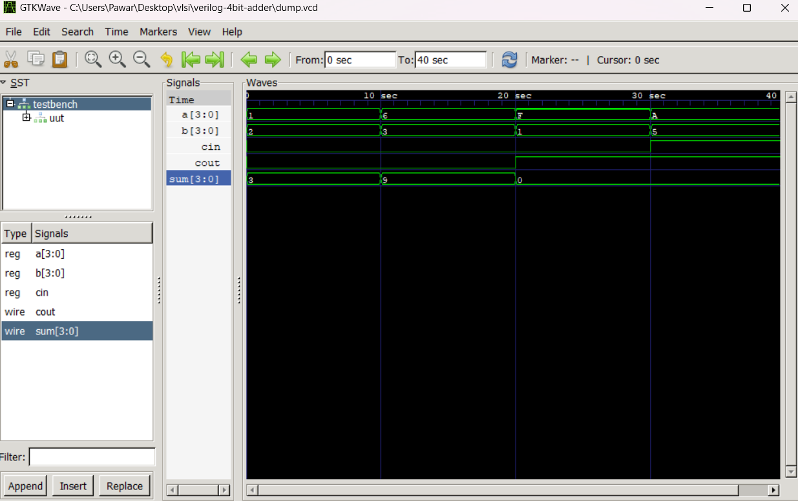

# 🔢 Verilog 4-bit Ripple Carry Adder

This project simulates a **4-bit Ripple Carry Adder** using Verilog. A ripple carry adder is built using multiple 1-bit full adders chained together.

---

## 📁 Project Files

| File             | Description                          |
|------------------|--------------------------------------|
| `full_adder.v`   | Verilog code for 1-bit full adder    |
| `ripple_adder.v` | 4-bit ripple adder using full adders |
| `testbench.v`    | Testbench to simulate input/output   |
| `dump.vcd`       | Waveform file for GTKWave            |
| `waveform.png`   | Screenshot of output waveform        |

---

## ✅ Truth Table (1-bit Full Adder)

| A | B | Cin | Sum | Cout |
|---|---|-----|-----|------|
| 0 | 0 |  0  |  0  |  0   |
| 0 | 1 |  0  |  1  |  0   |
| 1 | 1 |  1  |  1  |  1   |
| 1 | 0 |  1  |  0  |  1   |

---
## 🧠 Waveform Output



## ▶️ How to Simulate

### 1️⃣ Compile
```bash
iverilog -o adder.vvp ripple_adder.v full_adder.v testbench.v
